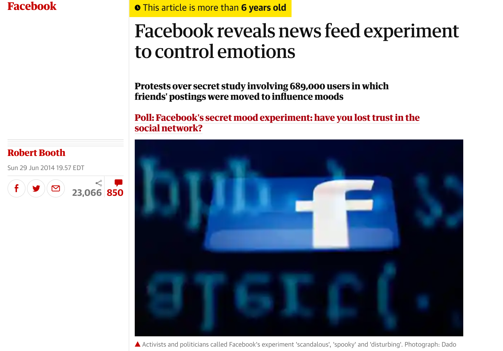
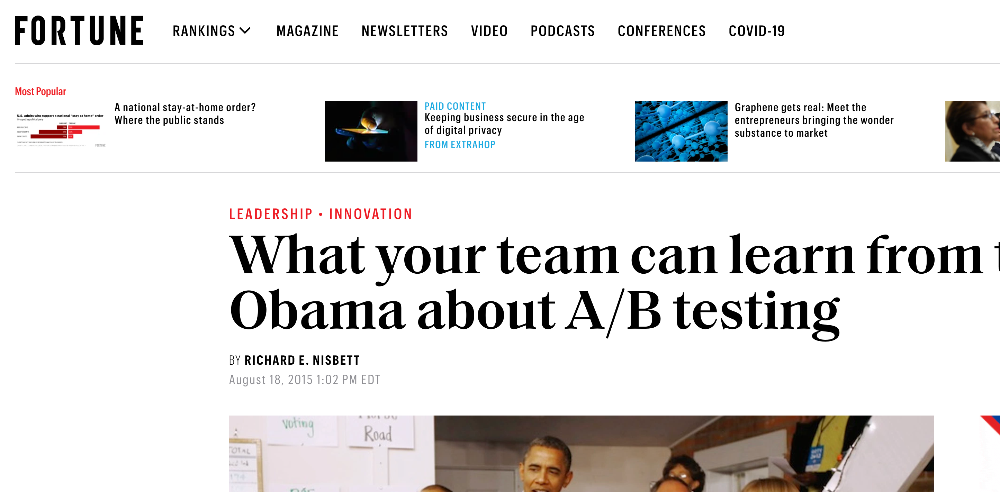
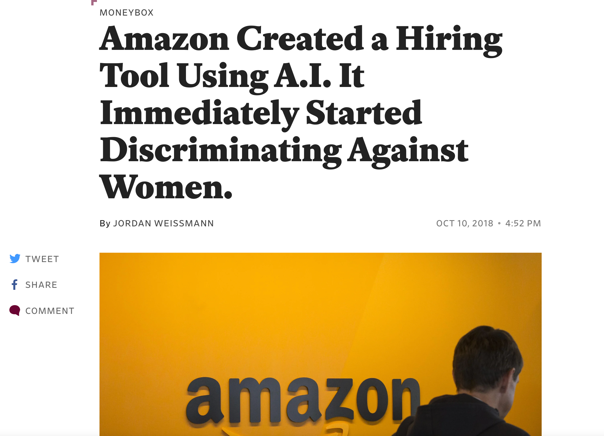
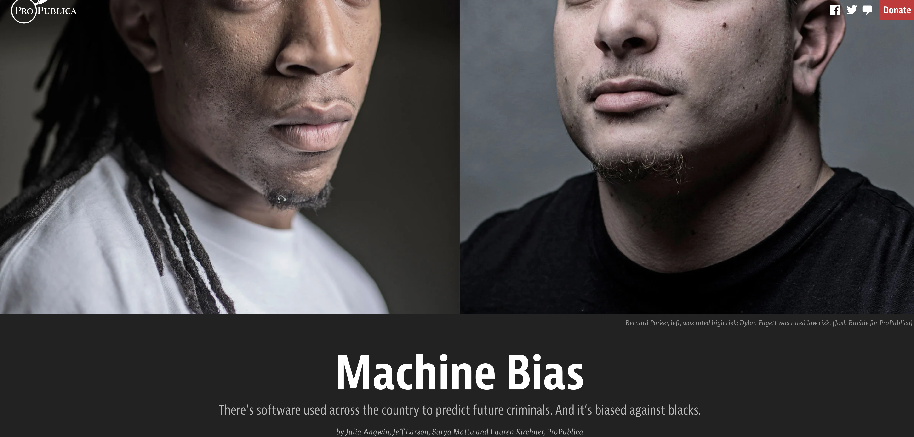
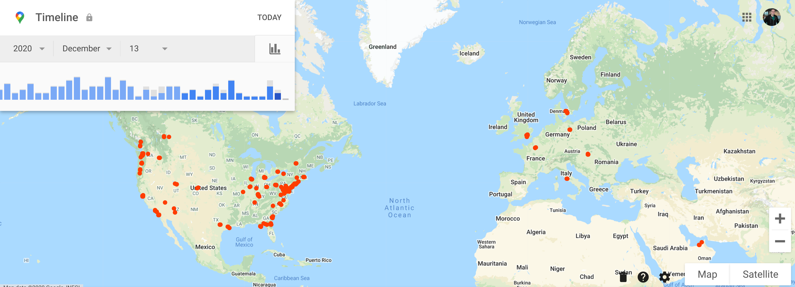
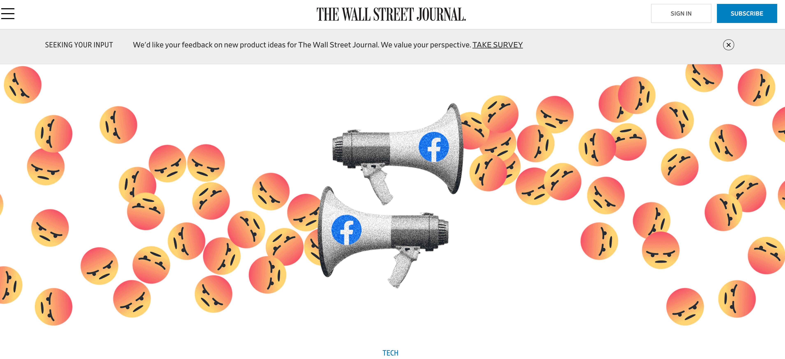
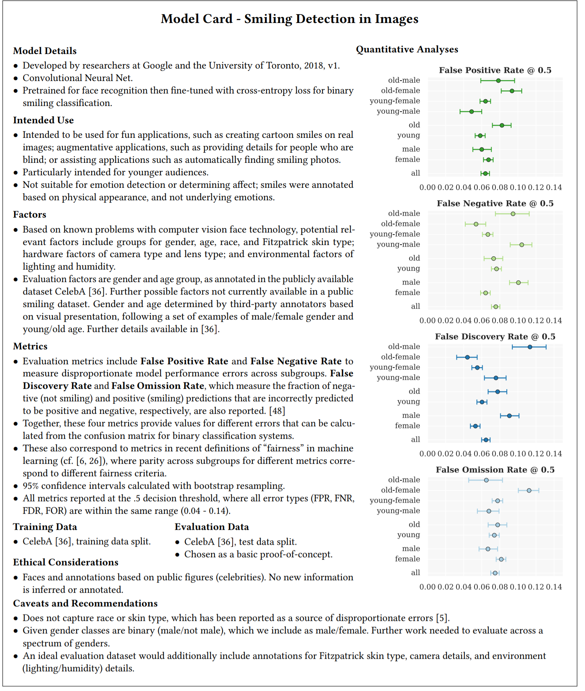

--- 
pagetitle: "Week 15 - Data science ethics"
---

# Week 15

## Week 15 Learning objectives

Data science 

:::keyidea

At the end of this lesson you will be able to:

* Identify key ethical issues throughout the data science process
* Understand that data science ethics goes beyond training data bias
* Know key people and resources in the field of data science and AI ethics
* Be able to articulate why ethics is a key factor in data science projects 

:::

## The ethics of data science

This is the last lecture of advanced data science and with this lecture we are focusing on one of the most important topics in the field. The ethics of how we collect, use, interpret and automate with data is a subject that could easily take up an entire course. We obviously don't have time to go into that much detail, so the purpose of this lesson is to highlight some of the key issues that will certaintly affect you as you use data and point you to people and resources that can help guide your decision making in a longer term way. 

Data science ethics, like many subjects around data science, came up too late. Data became cheap to collect and store much faster than we could develop tools, techniques, processes, and legal structures to understand and manage the consequences of these measurements. Fortunately, over the last 5-10 years there has been significant thinking on the topic and the importance of ethical, legal, and regulatory thinking in data science is on the rise. 

Data science ethics is a complicated an multi-faceted topic. But one of the core principles is that much of the data we collect and use has consequences either directly or indirectly for people. The consequences may be about their privacy, their livelihood, their freedom, or their identity. The sneaky thing about data is that by collecting information into numbers in a spreadsheet, it obscures these consequences behind something that seems more scientific and abstract. Remembering that data is collect by, about, and for people is a unifying principle in understanding the ethics of data science. While the implications of data ethics and can do compel codification into formal legal and moral frameworks it is also worth remembering the golden rule - treat other's data as you would want yours treated. 

In this lecture we are going to cover ethical issues in:

- Experimental Design
- Data Collection
- Defining Objective Functions
- Algorithmic Design 
- Data Interaction Interfaces
- Data Decision Making 

As you can imagine we will only be able to briefly touch on each of these topics. Moreover, these are only some of the big issues that will be facing not just you as data scientists, but our society more broadly and deserve deeper attention. In fact, there is almost no area of data science that is more important at this moment in history then helping to decide how we will use data as a society for the next several decades. 

## Ethics in experimental design

People have been performing experiments that collect data for hundreds of years. The history of experimental design is littered with examples where focus on scientific discovery or business expedience has left human rights wanting. It is therefore no surprise that the ethical considerations in experimental design are some of the most mature of any area of data science. Despite this maturity, major ethical issues in experimenal design are still at the forefront of conversations around data science ethics. 

In the biomedical and behaviorial sciences, these major problems with experimental ethics drove the development of [Institutional Research Boards](https://en.wikipedia.org/wiki/Institutional_review_board): 

> Formal review procedures for institutional human subject studies were originally developed in direct response to research abuses in the 20th century. Among the most notorious of these abuses were the experiments of Nazi physicians, which became a focus of the post-World War II Doctors' Trial, the Tuskegee Syphilis Study, a long-term project conducted between 1932 and 1972 by the U.S. Public Health Service, and numerous human radiation experiments conducted during the Cold War. Other controversial U.S. projects undertaken during this era include the Milgram obedience experiment, the Stanford prison experiment, and Project MKULTRA, a series of classified mind control studies organized by the CIA.

IRBs form an important component of protecting human subjects for academic studies subject to these requirements. But the rapid pace of development and the move toward collecting abundant data on technology platforms unregulated by IRBs has led to a new set of concerns. One of these concerns is that most human subjects experiments run today are not run by academics who are subject to IRB requirements. Rather they are run by tech companies who run hundreds or thousands of human subjects experiments every day. These unregulated experiments are not subject to the review of external committees and do not require consent. In fact, you have probably been in a human subjects experiment today if you have logged onto almost any social media or technology site. 

Some of these experiments are relatively benign. But some are more insidious. For example, Facebook [ran a human subjects study](https://www.theguardian.com/technology/2014/jun/29/facebook-users-emotions-news-feeds) where they randomized hundreds of thousands of individuals to see sad news and observed a change in their measured emotional state on the platform. 

This experiment got a lot of attention - primarily because it was actually published in an academic journal where it was revealed that the researchers did not obtain consent or have IRB oversight. 

While this was upsetting on its own, the thing to be aware of is that randomzied human subjects experiments (called A/B tests) are happening all the time on all internet sites. Sometimes, these experiments are even held up in glowing terms. For example, the Obama re-election campaign received a lot of [positive attention](https://fortune.com/2015/08/18/mindware-nisbett/) for optimizing donations to their website using unregulated A/B tests. 

You will likely run into unregulated human subjects experiments if you do data science in an industrial setting - particularly in consumer focused companies. If you haven't already, it is worth taking a [course in human subjects research](https://www.jhsph.edu/offices-and-services/institutional-review-board/training/) since your role as a data scientist will frequently depend on data collected from human subjects. 

Experimental design goes beyond experiments that are performed on humans. A huge amount of data is also being passively collected about you - from the websites you visit, to the responses you enter into learning management systems, to the ways that you interact with apps, to the health information collected in the course of your treatment. 

This  firehose of passively collected information is increasingly used in observational studies that re-purpose the data for research purposes. Think of the examples we saw in class earlier where [cell-phone mobility data were used to model Covid impacts of social distancing](https://www.nature.com/articles/s41586-020-2923-3). But this is also a common practice in epidemiology with electronic health records, fitness apps, and other passively-collected data being turned into research data sets. 

These data represent information collected from humans and are often used in public health to try to better understand how to improve people's health. But it is worth considering the potential risks of re-purposing unconsented data from hundreds, thousands, or millions of people and to make efforts to minimize risks to participants. 

## Ethics in data collection

If ethics in experimental design are the most well known and most mature in terms of regulation and thinking, ethics in data collection are often foremost in people's minds when thinking of data science ethics. 

### Sampling bias

One of the key issues in data science ethics is actually a core principle of biostatistics as well. Recall the central dogma of machine learning. 

An important component of machine learning is that training data are sampled from a population and a predictor is developed based on that sampling. However, both the population being sampled and the sampling scheme can - of course - have a major impact on the results of developing a machine learning algorithm. 

This issue has been overlooked by engineering teams who are able to engineer ML pipelines to make predictions, but don't seek to understand the sources of variation in their data and potential consequences for people. For example, Amazon built a machine learning model to predict who to hire. But they built the algorithm based on people they had already hired, leading to bias baked into the system - Amazon had mostly hired male engineers! So when they trained their algorithm it [incorporated that bias into their hiring system](https://slate.com/business/2018/10/amazon-artificial-intelligence-hiring-discrimination-women.html) . 

This same issue has played out in algorithmic sentencing, where predictors for recidivism are based on data from racially biased justice system data. 

This area of data science ethics is a critical one for facial recognition systems, voice assistants, and any other artificial intelligence interface that interacts with humans. A recent example is a face depixilizer that was trained on primarily Caucasian people and led to images that were depixilized in such a way that they made faces look more Caucasian: 

<blockquote class="twitter-tweet">
Face Depixelizer  Given a low-resolution input image, model generates high-resolution images that are perceptually realistic and downscale correctly.  😺GitHub: <a href="https://t.co/0WBxkyWkiK">https://t.co/0WBxkyWkiK</a> 📙Colab: <a href="https://t.co/q9SIm4ha5p">https://t.co/q9SIm4ha5p</a>  P.S. Colab is based on the<a href="https://t.co/fvEvXKvWk2">https://t.co/fvEvXKvWk2</a> <a href="https://t.co/lplP75yLha">pic.twitter.com/lplP75yLha</a>
&mdash; Bomze (@tg_bomze) <a href="https://twitter.com/tg_bomze/status/1274098682284163072?ref_src=twsrc%5Etfw">June 19, 2020</a></blockquote> 

This led to a long discussion about the ethicial issues with software like this and a leading figure in AI Ethics pointed out that while dataset bias could play a role here, the problems with software like this go beyond data set bias - to the choices that humans make, the ways they choose to publicize their work, who is involved in the research, what the implications of the research are for people of different backgrounds, and how the tools are used by others. 

<blockquote class="twitter-tweet">
I’m sick of this framing. Tired of it. Many people have tried to explain, many scholars. Listen to us. You can’t just reduce harms caused by ML to dataset bias. <a href="https://t.co/HU0xgzg5Rt">https://t.co/HU0xgzg5Rt</a>
&mdash; Timnit Gebru (@timnitGebru) <a href="https://twitter.com/timnitGebru/status/1274809417653866496?ref_src=twsrc%5Etfw">June 21, 2020</a></blockquote> 

### Privacy

Data privacy deserves way more attention than we will be able to give it here. The dramatic drop in the price of collecting and storing data has led to an entire underground economy in the data that are collected about you. Apps and websites collect your private information and much of that information is bundled and sold. 

The extent to which you are tracked online may or may not be surprising to you. For example if you use Google Maps or have an Android phone (like your instructor does) you can go to: https://www.google.com/maps/timeline and see that Google has the entire history of everywhere you have traveled.  

I use Google Maps regularly to give me directions so I'm not surprised or deeply troubled by that app having my location. But many other apps also collect that same information - [sometimes unnecessarily](https://www.theverge.com/2019/7/3/20681508/tracking-pixel-email-spying-superhuman-web-beacon-open-tracking-read-receipts-location).

This information is then [bundled, bought and sold by data brokers](https://www.propublica.org/article/everything-we-know-about-what-data-brokers-know-about-you). It is frequently used by researches, businesses, and others to understand the behavior of people for everyting from scientific studies to advertising. 

Privacy promises to be a thorny issue going forward. It is hard to imagine we will go back to a version of the world where data is not collected at large scales. But increasingly, the use of data is being regulated. The [General Data Protection Regulation](https://gdpr-info.eu/) applies to citizens of the European Union and begins to outline rights you have when it comes to collecting and using people's data. California has recently passed privacy regulation as well in the form of the [California Consumer Privacy Act (CCPA)](https://oag.ca.gov/privacy/ccpa). However, these laws only apply to individuals from those geographic regions and do not rule out the use of personal information. 

### Surveillance

There are parts of the world where facial recognition technology [are used extensively](https://www.usnews.com/news/cities/articles/2020-08-14/the-top-10-most-surveilled-cities-in-the-world) to monitor the behavior of individual people. While this can seem futuristic and far off, even here in Baltimore police used drones to conduct [warrantless surveillance](https://www.wired.com/story/cities-curb-surveillance-baltimore-police-took-air/) of city residents. 

But this is not the only way that surveillance technology impacts our lives. While facial recognition is an obvious surveillance technology, it may also impact other areas of your life. Credit scores are based on financial transaction data passively collected from credit cards, loan applications, and bank accounts. If you work for financial institutions you may use this data to, for example, decide who has access to financial services. 

## Ethics in objective functions

[Goodhardt's Law](https://en.wikipedia.org/wiki/Goodhart%27s_law), as stated by Marilyn Strathern in its general form is: 

> When a measure becomes a target, it ceases to be a good measure.

A key issue in data science ethics is in the objective functions we choose to optimize. A recent example is the discovery by Facebook scientists that their platform was increasingly driving division among people. 

At first there was interest in trying to reduce division. However, it was quickly discovered that the solutions to reducing division also often reduced the amount of time people spend on the Facebook platform. Since the business model of Facebook focuses on serving ads to people on the site, their objective function was to keep people on the site for longer. 

This example is just one of many where the simplification of complex processes into a small number of necessarily limited objectives can have unintended consequences. As data scientists you will be encouraged to identify metrics and targets and to optimize your data collection, algorithms, and inference to optimize for these objectives. But it is important to consider the consequences of narrow optimization. 

### Varying objectives

Another key issue with objective functions is that it is important to understand what "good enough" is. For example, screening procedures for rare diseases must have extremely high sensitivity and specificity to avoid overstating false positives. Similarly, I am ok with an AI that sometimes identifies the wrong child among my photos in a search, but would be very uncomfortable with a self-driving car that made a similar number of mistakes. 

Objective functions, by their nature, simplify the goal of a data science process. This simplification can lead to bias both by not considering the alternatives to an objective function and by choosing how to optimize the objective function. For example, US News has given credit to schools with higher average SAT scores. But selecting students with higher SAT scores may also select students for other factors - say the level of resources in their high school. Focusing on simplifications like SAT scores are convenient, but may not give the full picture of the potential of a prospective student. There is also the way that an objective function is optimized - do we optimize over all students? Over a subset of students? Do we apply different weights to legacy students or athletes? All of these choices have real human conseqences, but may be hidden within the objective function. 

One major advantage of the move to quantitative definitions of objective functions is the ability to very clearly explain what you are optimizing and then to understand the consequences of that optimization empirically. But it only works if you do the work of understanding your optimization approach. 

## Ethics in algorithms

Algorithms are increasingly being used to determine what financial resources we can get, what colleges we can get into, what jobs we can get, how we are treated by the justice system, or how we receive healthcare. Many of the ethical issues in algorithms can be traced to issues with sampling or to the choice of objective function.  

However, algorithms themselves can create their own ethical issues. This may be surprising, since algorithms are often just collections of linear algebra operations or billions of aggregated summations. How can that lead to ethical issues? 

One of the most common issues with algorithms is that they give the *appearance* of being objective without actually being objective. As we have discussed, the objective function, the data, and the choices made by the analyst can all have a major impact on the results of any machine learning or inferential aglorithm. However, people automatically tend to assume that algorithms are more objective than humans. This assumption allows people to pass off highly biased or unfair algorithms as objective and beyond reproach. A common example is hiring algorithms which are assumed to be more "fair" than humans. But these algorithms (as the case with Amazon above shows) can be just as biased - sometimes even more so - than the humans they replace. 

Another key issue with algorithms is that algorithms are not designed to understand nuance. An example of this is if you have ever ran into an algorithmic customer service process on a website. It can be extremely frustrating to talk to a computer driven operator who may not understand the more subtle issue that you are having with the companies service. This issue can be mildly annoying for an individual who bought a toaster they don't like. But it can be life and death for people triaged by algorithms at hospitals, or denied credit or housing on the basis of an unappealable algorithm. 

Moreover, algorithms are often inscrutable and are rarely audited. This is true across a broad range of applications. For example, Google recently wrote a paper describing an algorithm that improved breast cancer screening. However, they [did not make either the data or the code](https://arxiv.org/pdf/2003.00898.pdf) for their approach available. If this algorithm is implemented into mammography, the scientific community will not be able to study and evaluate the potential risks of this algorithm without this code. Given the value of this technology it is not surprising the details were not revealed, but this represents another way in which algorithms can be dangerously underspecified and still have major real world consequences. 

One of the most interesting innovations in this area is the idea of model cards. [Model cards](https://arxiv.org/pdf/1810.03993.pdf) are a brief summary of the data, algorithm, and applicability of a machine learning model, including specifying to which populations it can be fairly applied. 

This is an example of [interpretable machine learning](https://christophm.github.io/interpretable-ml-book/) - another field that is growing in popularity as society grapples with the implications of algorithms that touch many parts of our lives. 

Finally, it is important to note that there is an [entire field](https://www.youtube.com/watch?v=f57LbLaOdUY) with significant ongoing research. Understanding how algorithms are optimized and their consequences is beyond the scope of this single lecture but is a growing and important subfield within data science.  

## Ethics in interfaces

Data science ethics extends to the interfaces we use to collect data. There is significant research that shows that websites use "dark patterns". 

> Dark patterns are user interface design choices that benefit an online service by coercing, steering, or deceiving users into making unintended and potentially harmful decisions.

This [dataset](https://webtransparency.cs.princeton.edu/dark-patterns/) has a collection of such dark patterns across thousands of websites. As a data scientist who may use or analyze these data to help improve customer retention for these companies, it is important to keep in mind how the human on the other end will be interacting with the interface you are optimizing. 

### "The exchange"

A core exchange at the heart of our current technological revolution goes like this: 

> "I will give you something for free in exchange for your data, which I will then sell to a third party to make revenue."

This business model drives most social media companies, search companies, and a variety of other smaller technology startups that you may or may not know about. These companies build technologies that help people do things that they want to do and give it away for free. But the consequence is that their data becomes the product that is sold. This has lead to the [famous saying](https://slate.com/technology/2018/04/are-you-really-facebooks-product-the-history-of-a-dangerous-idea.html): 

> "If you are not paying for it, you're not the customer; you're the product being sold."

It is important to keep this in mind as many data analytic jobs will be focused in sectors where data has been collected through "the exchange" and your use of that data may be highly profitable, but may also be doing things with the data that the user may never have expected. 

## Ethics in data decision making

As you continue to analyze data you will often be working with people who have less experience analyzing and working with data than you do. Executives, professors without experience in data analysis, managers, and government officials may rely on your analyses without understanding all of the implications that your data analytic or machine learning choices may have. This is a challenge for the data analyst ethically since the implications of data, algorithm, or application choice can be subtle and difficult to explain. 

These decisions can also be influenced because most data scientist work for someone who is not a data analyst. Their boss may have a motivation to get a certain answer, or re-purpose data in a way that may be compromising. It puts the data scientist in a difficult position since they may have to choose between doing what is right and being fired. A very recent example of this is an AI Ethics researcher at Google who [was fired during a dispute](https://www.technologyreview.com/2020/12/04/1013294/google-ai-ethics-research-paper-forced-out-timnit-gebru/) about a paper criticizing bias in some of Google's language models. 

Moreover, people in positions of power may decide to spend data scientific resources (data collection, research, or development) in ways that introduce unfairness or bias. These issues may be very transparent to a data scientist, but not as clear to others without technical insights. 

Finally, algorithms and data are increasingly driving decision making. These decisions are cross cutting and sometimes the data is used well; but sometimes the data is used as a prop to justify discriminatory, unethical, or unfair decisions. It is not possible to work as a practicing data scientist and avoid considering the implications of your work more broadly for society in an era when data touches every aspect of people's lives. 

## What you should do

This has been an incredibly brief tour of some of the high level data science ethics questions that are part of the advanced data scientist's life. You will notice that in many of the sections of this lecture there were not specific guidelines for how to handle these ethical considerations. This is for a couple of reasons. First, your instructor is aware of many of these issues but is not an expert. You will find links below to experts and resources that can carry you deeper. Second, each data analysis requires its own careful consideration of the risks and benefits and simplified advice is unlikely to generalize well across cases. Finally, this is an emerging and growing field where consensus is still being built. It is an important and exciting field, and I'd encourage you to read much more than you got in this single lecture. 

One thing to leave you with is that the National Academy of Sciences [published a Data Science Oath](https://www.nap.edu/read/25104/chapter/13#119), which hasn't received widespread adoption but may be a good place to start: 

> I swear to fulfill, to the best of my ability and judgment, this covenant:
> 
> I will respect the hard-won scientific gains of those data scientists in whose steps I walk and gladly share such knowledge as is mine with those who follow.
> 
> I will apply, for the benefit of society, all measures which are required, avoiding misrepresentations of data and analysis results.
>
>I will remember that there is art to data science as well as science and that consistency, candor, and compassion should outweigh the algorithm’s precision or the interventionist’s influence.
>
>I will not be ashamed to say, “I know not,” nor will I fail to call in my colleagues when the skills of another are needed for solving a problem.
>
> I will respect the privacy of my data subjects, for their data are not disclosed to me that the world may know, so I will tread with care in matters of privacy and security. If it is given to me to do good with my analyses, all thanks. But it may also be within my power to do harm, and this responsibility must be faced with humbleness and awareness of my own limitations.
>
> I will remember that my data are not just numbers without meaning or context, but represent real people and situations, and that my work may lead to unintended societal consequences, such as inequality, poverty, and disparities due to algorithmic bias. My responsibility must consider potential consequences of my extraction of meaning from data and ensure my analyses help make better decisions.
> 
> I will perform personalization where appropriate, but I will always look for a path to fair treatment and nondiscrimination.
> 
> I will remember that I remain a member of society, with special obligations to all my fellow human beings, those who need help and those who don’t.
> 
> If I do not violate this oath, may I enjoy vitality and virtuosity, respected for my contributions and remembered for my leadership thereafter. May I always act to preserve the finest traditions of my calling and may I long experience the joy of helping those who can benefit from my work.

## Additional Resources

:::resources

### Resources

* [fast.ai practical data ethics](https://ethics.fast.ai/)
* [Understanding the limits of AI, when algorithms fail](https://www.youtube.com/watch?v=Q2CSVYD7pYE)
* [The problem with metrics](https://www.fast.ai/2019/09/24/metrics/)
* [Can tracking people through cell phone data save lives](https://www.nature.com/articles/d41586-019-01679-5)
* [Abolish Big Data](https://vimeo.com/375310799)
* [Maths and tech specialists need Hippocratic oath, says academic](https://www.theguardian.com/science/2019/aug/16/mathematicians-need-doctor-style-hippocratic-oath-says-academic-hannah-fry)
* [Interpretable Machine Learning](https://christophm.github.io/interpretable-ml-book/)
* [Algorithmic Fairness](https://arxiv.org/pdf/2001.09784.pdf)
* [Election Emails](https://electionemails2020.org/) and [Dark Patterns](https://webtransparency.cs.princeton.edu/dark-patterns/) data sets. 
* [Data Science Ethics Chapter in Modern Data Science with R](https://beanumber.github.io/mdsr2e/ch-ethics.html#role-of-data-science-in-society)
* [Data for Black Lives](https://d4bl.org/)
:::

:::resources
### People

* [Timnit Gebru](https://twitter.com/timnitGebru) - Ethical AI
* [Alex Hanna](https://alex-hanna.com/) - Ethical AI
* [Arvind Naryanan](https://www.cs.princeton.edu/~arvindn/) - Dark Patterns
* [Emma Pierson](https://cs.stanford.edu/~emmap1/) - Algorithmic Fairness
* [Sharad Goel](https://5harad.com/) - Discrimination and fairness
* [Sherri Rose](http://drsherrirose.org/) - Fairness in health policy
* [Carl Bergstrom](https://twitter.com/CT_Bergstrom) - Disinformation 
* [Rediet Adebe](https://www.cs.cornell.edu/~red/) - Justice and AI

:::

## Homework 

:::homework
* __Template Repo__: https://github.com/advdatasci/homework15
* __Repo Name__: homework15-ind-yourgithubusername
* __Pull Date__: 2020/12/21 9:00AM Baltimore Time 
:::
